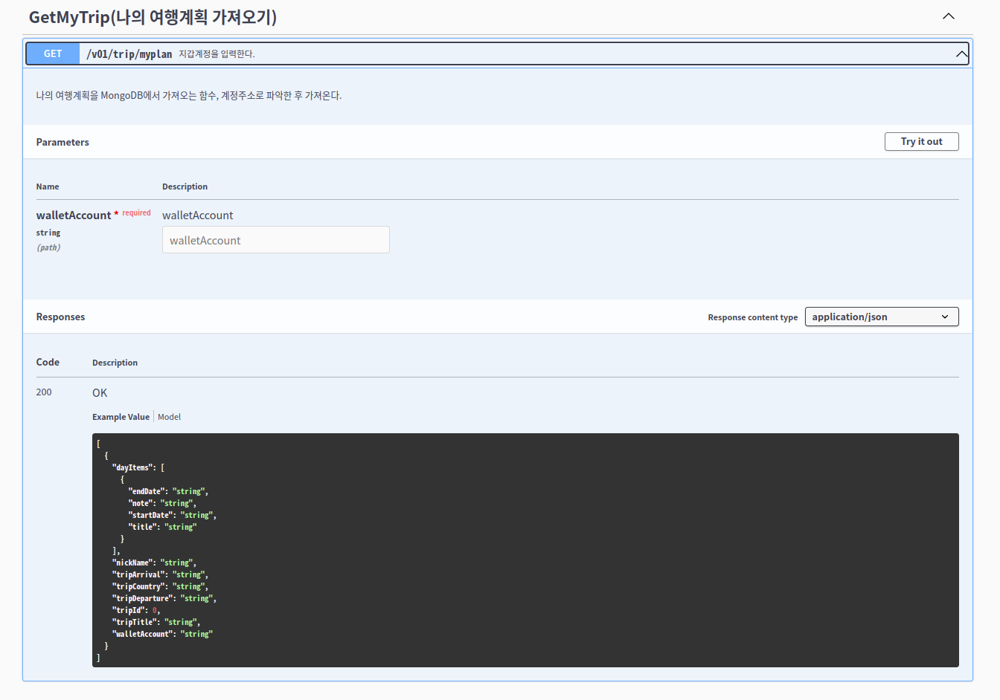

# Project : Trypto-server

## Getting Started

First, run the development server:

```bash
1. configure trypto-server/config/.config.toml

[server] ##nomal type
mode = "dev"
port = ":1323"

[db] #data access object
[db.user] # map type map[string]map[string]interface{}
host = "mongodb://localhost:27017"
user = "user"
pass = "user!@"
name = "trypto"

[db.account]
host = "mongodb://localhost:27017"
user = "admin"
pass = "admin!@"
name = "accountDB"

#worker pool job object
[[work]] #, jobs []job
name = "HeartBeat"
desc = "log"
excute = "x"
duration = 300
args = "resv"

[[work]]
name = "exam"
desc = "exam"
excute = "x"
duration = 60
args = "exam"

[log]
level = "debug" # debug or info
fpath = "./logs/go-loger" # log path
msize = 2000    # 2g : megabytes
mage = 7        # 7days
mbackup = 5    # number of log files

[contract]
DnftContract = "my dnft contract address"
PRIVATEKEY = "my wallet private key"

2. docker pull mongo db
4. Creating an database "trypto" in mongodb
5. Creating an "account" collection in mongodb
6. Creating an "dnftbadge" collection in mongodb
7. Creating an "tripPlan" collection in mongodb
8. Creating an "resource" collection in mongodb
9. import the ./badgeResource.csv file from the resource collection
10. go build .
11. ./main
12. Register users, issue badges, and test trip plans

```

Open [http://localhost:1323/swagger/index.html](http://localhost:1323/swagger/index.html) with your browser to see the API infomation.

## Curl Test

├── ./getMostIssuedBadges.sh

├── ./getMyAllDnftBadge.sh

├── ./createTripPlan.sh

├── ./createTripPlan2.sh

├── ./createTripPlanSimple.sh

├── ./deleteTrip.sh

├── ./getMyProfile.sh

├── ./getMyTrip.sh

├── ./getTripDetail.sh

├── ./koreaIssueBadge.sh

├── ./newYorkIssueBadge.sh

├── ./parisIssueBadge copy.sh

├── ./patchMyTrip.sh

├── ./registerNickname.sh

├── ./sydneyIssueBadge copy 3.sh

└── ./ukIssueBadge.sh

## Swagger API (ENG)

## http://152.69.231.140:1323/swagger/index.html

## Swagger API Screen Shot (Korea)





### Contract Address

<br>

### goerli

- ver 0.1 : 0xc40a82F2937Fb7b33764acde9D4758C2Ed8FE2E0

<br>

### mumbai

- ver 0.1 : 0xb3c72Df5bBDb985dac5eDa966b501B35830A8cb1
- ver 0.2 : 0x303766fAD71443073850E5Ad7E11a44d3Bd8BC97
- ver 0.3 : 0xAC6de0e2E7405C5E638b1EE3B1bC5F486A2Ef320
- ver 0.4 : 0xa38A89aaC82fFadD0845e45C02985A17bEbcCc3c
- ver 0.5 : 0x70f9643f9CBc3FBE078054fE5236be294B9D4532
- ver 0.6 : 0x2f9506b88bcb05392124E30975a8F8FB65b0cEc9
- ver 0.7 : 0xa8b4B25d0c6A3d3eBabc18cf1Cbb12D05ca2bE01
- ver 0.8 : 0x00Ece125AA0021aA3E20491919102b4ccB0f2E2C

<br>

### local

- ver0.1 : 0xb48099B07b0F959C71c2Fb49fDbCB542Ff2Ea59D
