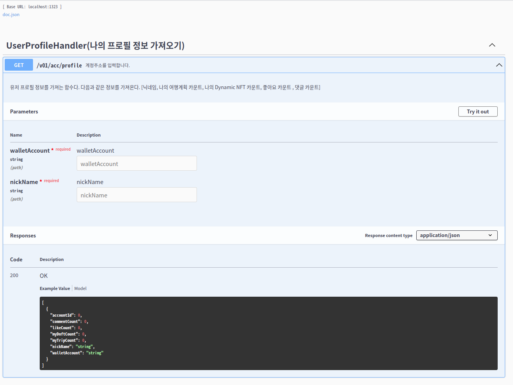

# Project : Trypto-server

## Model

### 1. 계정정보 테이블

- Account Collection
  - ID
  - 계정정보
  - 닉네임
  - 나의 여행계획표 카운트
  - 나의 DNFT 뱃지 카운트
  - 좋아요 숫자
  - 댓글 숫자

### 2. 여행계획표

- Travelplan Collection
  - 날짜 아이템에 다음의 항목들이 있다.
  - ID
  - 제목
  - 설명
  - 메모
  - 사진
  - 시간

### 3. 도감(DNFT 뱃지를 모아둔 도감)

### DNFT 뱃지

- Encyclopedia Collection
  - ID (dnft)
  - 이름
  - 사진
  - 설명
  - 나라

### 4. 나라/사진/설명 DB

- BadgeResource
  - ID
  - country
  - imgUrl
  - description

## controller

### 서비스

- 나의 닉네임 생성 계정정보와 쓰려고 하는 닉네임을 DB에 저장한다.
- 나의 여행계획 리스트 불러오기 API에서 DB쿼리를 통해 나만의 여행계획표 리스트를 가져오기
- 전체 커뮤니티 여행계획 리스트 불러오기 API에서 DB쿼리를 통해 전체 여행계획표 리스트를 가져오기
- 나의 도감 가져오기 API에서 스마트컨트랙트 함수 호출을 통해 나만의 도감을 가져오기
- 나의 프로필 정보 가져오기 API에서 나의 프로필 정보를 가져오기
- 나의 도감 상세 보기 API에서 DB 정보를 가져오되 스마트 컨트랙트 데이터와 싱크를 맞춰야함
- 뱃지(DNFT) 발급 위도,경도와 계정 정보를 받고 뱃지(DNFT) 발급을 할 수 있게 해야함

### API

## http://152.69.231.140:1323/swagger/index.html

### Contract Address

 

### goerli

- ver 0.1 : 0xc40a82F2937Fb7b33764acde9D4758C2Ed8FE2E0

 

### mumbai

- ver 0.1 : 0xb3c72Df5bBDb985dac5eDa966b501B35830A8cb1
- ver 0.2 : 0x303766fAD71443073850E5Ad7E11a44d3Bd8BC97
- ver 0.3 : 0xAC6de0e2E7405C5E638b1EE3B1bC5F486A2Ef320
- ver 0.4 : 0xa38A89aaC82fFadD0845e45C02985A17bEbcCc3c
- ver 0.5 : 0x70f9643f9CBc3FBE078054fE5236be294B9D4532
- ver 0.6 : 0x2f9506b88bcb05392124E30975a8F8FB65b0cEc9
- ver 0.7 : 0xa8b4B25d0c6A3d3eBabc18cf1Cbb12D05ca2bE01

 

### local

- ver0.1 : 0xb48099B07b0F959C71c2Fb49fDbCB542Ff2Ea59D
